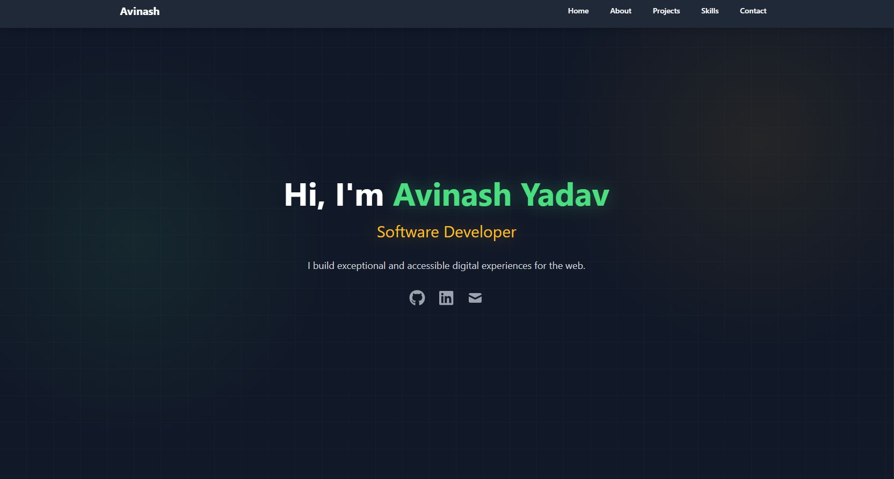
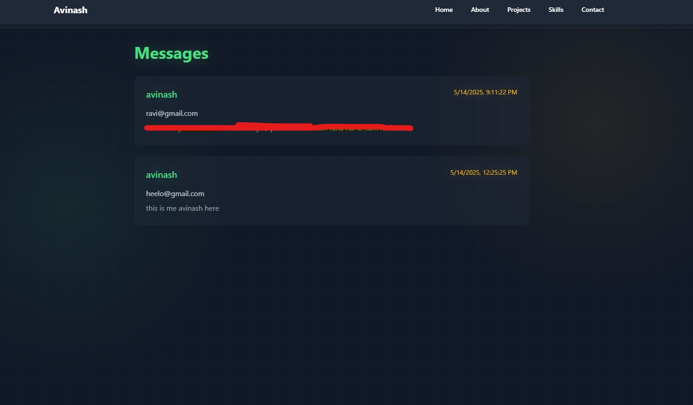
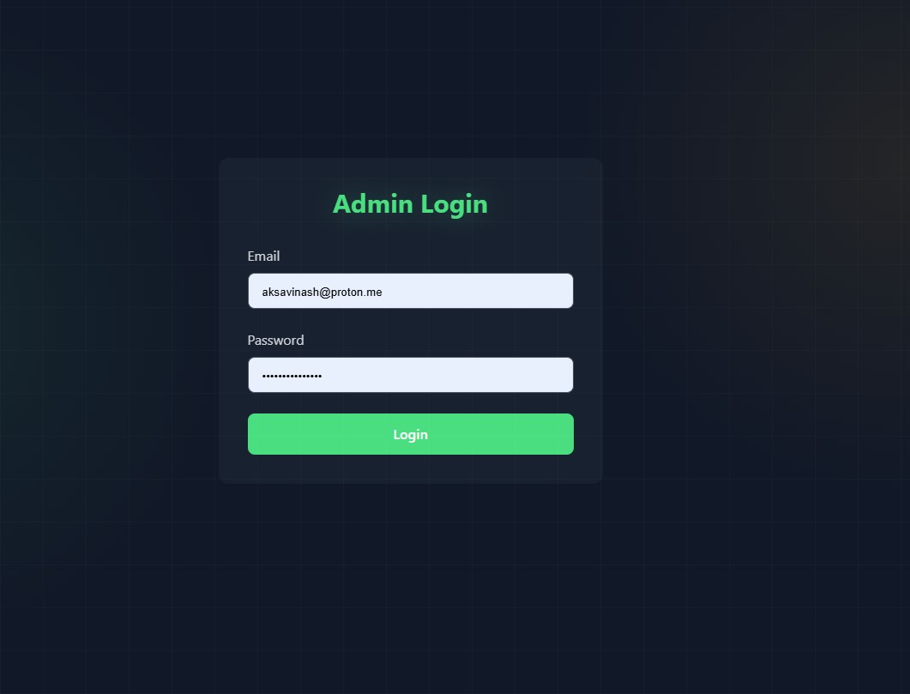

# My Portfolio Website

Welcome to my personal portfolio website! This project showcases my skills, projects, and contact information. It is built using **React.js**, **Vite**, and **React Router** for a seamless and modern user experience.

### Below are links for the deployed site:

- [Netlify Static Link](https://aks-avinash.netlify.app/)
- [Vercel Deployment Link](https://aksavinash.vercel.app/)

## Features

- **Responsive Design**: The website is fully responsive and works seamlessly on all devices (desktop, tablet, and mobile).
- **Smooth Navigation**: Utilizes React Router for smooth, client-side navigation between pages.
- **Dynamic Content**: Easily update your portfolio content (projects, skills, etc.) by modifying the data files or components.
- **Modern Tooling**: Built with Vite for fast development and optimized production builds.
- **Interactive UI**: Includes hover effects, smooth scrolling, and other interactive elements to enhance user experience.
- **Supabase**: Added Supabase to the backend to receive messages from the contact page, which I can view on my admin side.

## Technologies Used

- **React.js**: A JavaScript library for building user interfaces.
- **Vite**: A fast build tool and development server for modern web projects.
- **React Router**: A library for routing and navigation in React applications.
- **Tailwind CSS**: A utility-first CSS framework for styling (optional, if you're using it).
- **Framer Motion**: For animations (optional, if you're using it).
- **Git & GitHub**: For version control and hosting the project.
- **Email**: Currently, users can send me messages through the website, but you should contact me through LinkedIn and my email. Please don't spam; I am on the free tier for this.
- **DeepSeek and Other AI Tools**: I used many tools for creating, testing, and deploying my portfolio.
